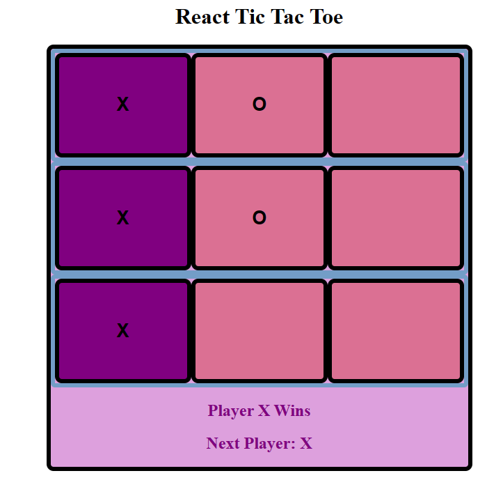

<a href="https://github.com/TennWilliams/tiktactoe_game"> Tik-Tac-Toe Exercise </a>
# Tik-Tac-Toe Game

This is a Tik-Tac-Toe game that was created using React.  I used useState to keep track of the which player's turn it is and whetehr the square is marked with a X or O.  Then a function checks to see if there us a winner and if so the winner is displayed on the screen.  I used CSS to style the board and to give each player a different square.

## Future improvments 
I would like to add a flip amination so when you click on the square to mark it with a X or O the square will flip and then have a X or O on it.  And also clear the screen once a winner is declared.

## Run Code
To run this code you must clone this code on the command line and run it on a local server.

License through MIT
